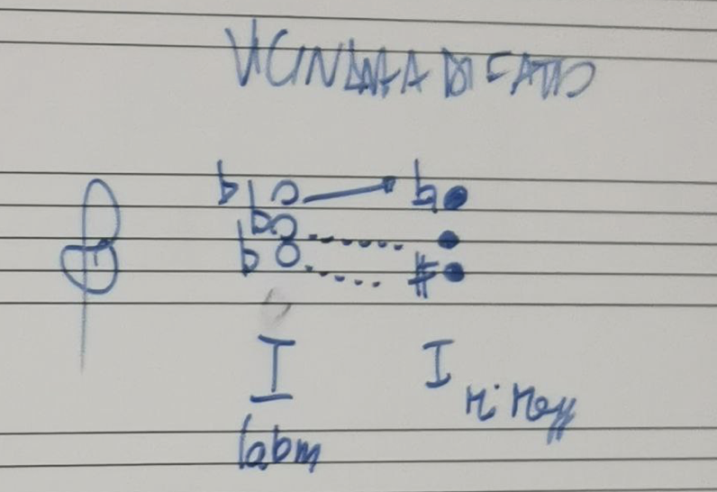

# 2024-05-07

#### Compiti per oggi
- Beethoven sonata pf n.8
    + mov1
    + mov2
- Beethoven sonata pf n.9
    + mov1
    + mov2
- Bach fuga
    + n.15
    + n.16

#### Esame
- durata: 15 min
- compito:
    1. fuga a scelta
    2. forma a scelta (tra quelle viste)
        + periodo Barocco, Classico
        + iniziare a proporre qualcosa
        + del proprio strumento o no
- tesina:
    + svolgimento:
        * ritaglio le righe della partitura
        * metto appunti sopra e sotto, con eventuali righi pentagrammati di riduzione, analisi…
    + da consegnare:
        * una copia alla commissione
        * una copia da portare e da commentare
    + graficamente:
        1. originale
        2. riduzione armonica
        3. altro
    + analisi:
        * armonica
        * fraseologica
        * formale
- sportello in preparazione dell'esame

Prassi di analisi:
- irregolarità: il ternario

---

## Forma Tema e Variazioni

- altri nomi:
    + _Tema e Variazioni_
    + _Ciclo di variazioni_
    + _Variazioni sul tema_
- inserito
    + come struttura completa
    + struttura a più movimenti
        * solitamente, nel mov1
        * al posto della _Forma sonata_
            > es. Beethoven sonata pf n.12 op.26

Analisi
- elementi di base
    + ripetizione
        * necessario per definire gli elementi caratterizzanti della composizione
    + variazione
        * _Sviluppo_: rientra anche qua
        * anche la ripetizione può rientrare qua
    + contrasto
- nel Novecento: differenza tra
    + _Variazione_: modifica "di peso"
        * ma non è ancora _Sviluppo_
    + _Variante_: modifica minima

Tema e Variazioni:
- struttura di variazione
    + pre-classica, barocca:
        * nei _double_ delle Suites
            > _double_: parti ripetute con minime variazioni nelle danze delle Suites
        * variazioni polifonica
            > es. Bach, Goldberg variations
        * _Forma Passacaglia_ o simili
    + classica:
        * ciclo indipendente
        * con una serie di caratteristiche: qualcosa rimane altamente riconoscibile e qualcosa viene modificato
        * _Variazione_: deve aggiungere significato, non basta una semplice _Variante_
- parametri che possono essere variati o mantenuti intatti: tutti i parametri della texture
    + melodia: variazione più semplice
        * solitamente: ornamentazione
    + armonia: ri-armonizzazione del tema
        * accordi alterati, sostituzioni armoniche…
    + modo: variazione in minore
        * caso particolare del cambio di armonia
        * al parallelo minore (no relativa minore)
    + ritmo: spesso sovrapposto ad altri cambiamenti (melodia, armonia)
        * nella melodia principale, nell'accompagnamento…
            > es. accompagnamento: da accordi ad arpeggi

            > nel Novecento: anche variazioni puramente ritmiche
    + timbro: ha senso con l'orchestra
        > Schoenberg, Orkesterstücke: variazioni dei timbri
    + metro:  mix con elementi precedenti
    + tempo: mix con elementi precedenti
        > es. Allegro, Calmo
- nel Classicismo: percorso di allontamento graduale dal tema
    + percorso tipico:
        * mi allontano
        * penultima variazione: al modo minore
        * ultima variazione: brillante

---

### Mozart K431

Struttura:
- mov1 "Andante grazioso"
    + 6 variazioni
        * var in modo minore: n.3
        * ultima var: brillante
- mov2 "???"
- mov3: manca il mov lento
- mov4 "Rondò brillante alla turca"

Mozart:
- vari cicli di variazioni
    + ma un po' brevi

---

### [Beethoven n.12 op.26](../materiali/Beethoven/Beethoven%20sonata%20pf%20n12%20op26/Beethoven%20sonata%20pf%20n12%20op26%20-%20score%20-%20ed%20Breitkopf.pdf)

Sonata:
- struttura:
    + mov1 "Andante e variazioni"
    + mov2 "Scherzo": tempo veloce
        * posizione insolita
    + mov3 "Marcia funebre": tempo lento
        * sorta di inversione tra mov2 e mov3 per l'alternanza dei movimenti "Veloce-Lento-Veloce-Lento"
    + mov4 "Allegro"

---

#### Mov1 "Andante con variazioni"

`[Compito]`
- analisi del tema
    + formale
    + fraseologica
    + armonica

Approccio all'analisi:
1. della texture
2. analisi del tema
3. ricerca degli elementi variati nelle variazioni

Struttura:
- tema
- var1: cambia melodia, accompagnamento
- var2: cambia ritmo
- var3: cambia armonia con cambio in modo minore
- var4: riprende l'andamento festoso
    + cambia il timbro: attenzione ai salti d'ottava
- var5: più rapida, brillante
    + cambia ritmo, armonia

Tactus:
- se non indicato dell'autore, non varia
- nella prassi esecutiva:
    + variazione della pulsazione anche se non indicata
        > es. in modo minore: più lenta del tema
        
        > es. ultima variazione: più brillante, più veloce del tema >> carattere conclusivo

---

### Beethoven sonata n.8 "La patetica" mov2

[Ascolto](https://m.youtube.com/watch?v=1FP7NosLxkw)
- episodi molto caratterizzati
- Tactus: varia molto in ogni episodio

Sinonimi:
- Rondò
- Lied in forma ciclica
- Lied in forma di rondò

Mov2:
- cosa significa _Rondò_ per Beethoven
    + da prendere a esempio

Struttura sonata:
- mov1: togliendo le parti in "Grave" è in _Forma sonata_
    + "Grave": introduttivo
        * ritorna dopo l'esposizione e alla fine
    + "Allegro": _Esposizione_ in _Forma sonata_
    + "Grave"
    + "Allegro": _Sviluppo_, _Ripresa_
    + "Grave"
    + coda sul tema dell'Allegro
        * sembra ricordare la forma Rondò
- mov2: _Forma Rondò_
    + struttura `A B A C A`
        * 5 episodi
        * minimo per definirlo un Rondò
- mov3: _Forma Rondò-Sonata_

`[pausa]`

Analisi:
- battute 42-44: "vicinanza di fatto"
    + modulazione ai toni lontani tramite suoni omologhi
    + non è un'enarmonia completa
    + suoni vicini: con "scivolamento cromatico"
        * elemento non del Classicismo

Attenzione alle definizione:
- _Sviluppo_: ri-elaborazione di materiale già esposto
    + non basta il movimento armonico
        * potrebbe essere anche una vera e propria sezione

---

## Scherzo

- nasce da Beethoven (vedi lezione scorsa)
- deriva dal Minuetto
    + struttura ternaria molto chiara
    + tempo: ternario "in 1"
    + è una canzone
    + struttura binaria asimmetrica
    + _Coda_: opzionale
- struttura:
    1. prima parte "Scherzo"
        * struttura binaria asimmetrica
    2. seconda parte "Trio"
        * il tempo rallenta, anche se non indicato
        * carattere più lirico
        * è una canzone
    3. terza parte: ripresa dello "Scherzo"
        * ripresa con variazioni
        * non un semplice "da capo" come nel Minuetto
    + coda finale
        * spesso "coda alla breve": in tempo binario
        * coda molto lunga, composta da 2 parti: tema conclusivo e coda
- tempo molto rapido, quindi cambiano gli elementi dell'analisi fraseologica
    + _inciso_: unità di più piccolo significato
        * solitamente corrisponde al tempo in chiave della battuta
        * quando il tempo è molto lento: uno dei _semi-incisi_
            > es. Bach: spesso si suona alla suddivisione
        * quando il tempo è molto veloce: mancano almeno 2 tempi primi. Quindi: 1 battuta = _semi-inciso_
            > es. Beethoven, scherzo

`[Compito]`
- Beethoven sinfonia n.3 "Eroica"
    + ascolto
    + analisi dall'ascolto "ad ampia gittata"
        * armonica
        * fraseologica
        * formale: dell'inizio di un segmento (scherzo, trio, ripresa dello scherzo)

`[Compito]`
- Schubert sonata D960 mvt1
    + analisi:
        * formali (a grandi linee)
        * no fraseologica, formale
    + aiutarsi con gli ascolti

---

## Fuga

### Bach fuga n.15 in Sol

Stretto:
- sovrapposizione melodica di 2 elementi
    + qualcosa prosegue, qualcosa inizia
- da non confondere con l'_Elisizione_

Bach fuga n.15 in Sol:
- [vedi pagine mandate dalla prof](../materiali/Bach/Bach%20preludi%20e%20fughe/Bach%20fuga%20n15%20BWV860%20-%20analisi%20Rebora.pdf)
- struttura:
    + esposizione
    + contro-esposizione 1
    + divertimento 1
    + contro-esposizione 2
    + divertimento 2
    + stretto
    + coda
    
`[fine lezione]`