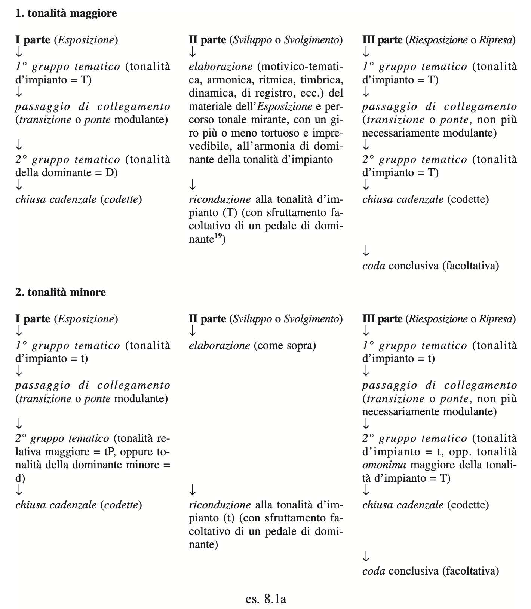
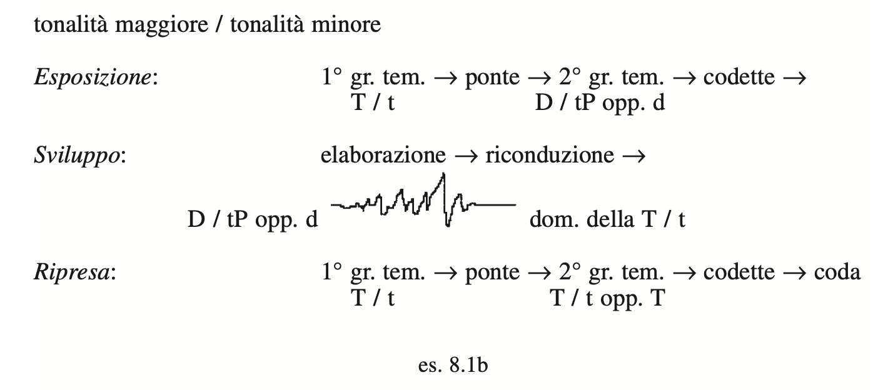

# Appunti - Azzaroni ([file](../materiali/Azzaroni%20Canone%20Infinito%20cap08%20-%20Forma%20e%20Fuga.pdf))

# Cap08 - La costruzione formale `[slide 1, pag 467]`

Riemann: forma
- _astratta_
    + esempi:
        * forma binaria
        * forma ternaria
        * forma sonata
        * Bar-form
        * Lied-form
    + modelli concettuali, schemi teorici
        * per distinguere le tipologie di opere musicali
- _concreta_
    + scheletri pre-compositivi
    + configurazioni globali (_Gestalten_)
        * si manifestano nei risultati finali

Clemens Kühn: 4 aspetti della forma
1. il _piano_ generale dell'opera
    + tendenza compositiva prevalente
2. le _transizioni_
    + fra le parti dell'opera
        * realizzazione delle diverse idee
3. la _totalità_ degli eventi musicali
    + melodia
    + armonia
    + timbro
    + ritmo
    + tecniche compositive
    + …
4. l'_idea_
    + rivelata nella forma dell'opera
    + contenuto intrinseco

Kühn: 5 principi delle _dinamiche processuali_
1. ripetizione
2. variazione
3. diversità
4. contrasto
5. mancanza di relazione

Distinzione tra forma:
- come _genere_
    + funzioni extra-musicali, para-musicali
    + esempi:
        * interconnessione con testi verbali: madrigali, recitativi, arie d'opera…
        * interconnesione con la danza: balletti, Minuetto, Valze, Suite barocche…
        * rappresentare suggestioni prodotte dalla natura: poemi sinfonici…
        * invenzione musicale: Toccata, Fantasia, Divertimento, Esercizio, Studio…
- come _processo_
    + tra concezione astratta e realizzazione sonora
        * da elaborazione a realizzazione
    + _agente formante_

Wilibard Gurlitt: tempo come _Agente formante_
- 3 principi:
    1. _mensura_: misura _quantitativa_
    2. _tactus_: misura _qualitativa_
    3. _tempo_:
        * modificazione del movimento in velocità, variazione
- ogni principio domina in un _genere_ musicale
    1. _mensura_: Partita
    2. _tactus_: Suite
    3. _tempo_: Sonata

Asafev:
- forma: manifestazione dell'azione nel tempo
    + forma: schema construttivo percepito durante l'ascolto
        * organizzazione del movimento musicale
        * _processo_ più che _schema_
- forma: architettura
    + prodotta dalle articolazioni temporali del suono
    + ha dei _punti d'appoggio_

_Forma come architettura_: 2 principi generali
1. accostamento di 2+ sezioni
    + _forme a giustapposizione_ (_Reihungsformen_)
        * abbinamento tra parti equivalenti
        * ripetizione, contrasto (domanda-risposta)…
        * esempi: forma-Lied, Minuetto, Rondò, Scherzo…
2. elaborazione compositiva di un nucleo primario
    + _forme a sviluppo_ (_Entwicklungsformen_)
        * progressione…
        * esempi: forma-sonata, forme contrappuntistiche (Canone, Fuga, Invenzione forme di variazione (Passacaglia, Ciaccona)), Variazioni sul tema…

---

## Forme a giustapposizione `[slide 4, pag 470]`

### Forme Lied `[slide 4, pag 470]`

#### Lied monopartito `[slide 4, pag 470]`

Struttura:
- 1 sezione
    > **A**
- ampliata con
    + ripetizioni
    + aggiunte

#### Lied bipartito (forme binarie) `[slide 4, pag 470]`

Struttura:
- antenato delle forme-sonata
- 3 tipi:
    + _a 2 frasi_: forma binaria semplice
        > **|: A B :|: A B :|**
    + _a 3 frasi_: forma minuetto
        > **|: A :|: B  A(opp. A') :|**
    + _forma di movimento lento_:
        > **A1 A2**
- esempi:
    + _Volkslieder_
    + danze antiche
    + Suite barocca
    + Bach, Invenzioni a 2 voci

**Forma _a 2 frasi_**:
- 2 sezioni tematiche simili
    + divise in 2 frasi (A B)
- percorso:
    + A: (opzioni tipiche)
        * T -> D
        * mod. T -> D: dalla tonalità della Tonica alla tonalità della Dominante (maggiore o minore)
        * T (minore) -> rel. maggiore
    + B:
        * ? -> T (opposto dell'andata)

**Forma _a 3 frasi_**:
- percorso:
    + A:
        * T -> T
        * T -> D
        * T -> rel. maggiore/minore
        * T -> D della rel. maggiore/minore
    + B:
        * ? -> T
        * sul finale: cadenza sulla D o su T vicina
    + A(opp A'):
        * simile alla A iniziale
        
**_Forma di movimento lento_**:
- forma _a 2 frasi_
    + ma senza ripetizione
- esempi:
    + Aria con _da capo_
- percorso:
    + A1:
        * T -> D
    + A2:
        * T -> T (stasi)

#### Lied tripartito con ripresa (forme ternarie) `[slide 6, pag 472]`

- terza sezione: _ripresa_
    + uguale o variata
        * **A || B || A**
        * **A || B || A'**
    + ma è diversa da
        * **A || B A**: il secondo **A** fa parte dell'architettura
- sezioni:
    + **A**: funzione _espositiva_
    + **A'**: funzione _riespositiva_ e _conclusiva_
    + **B**: _Trio_, funzione _contrastiva_
        * dimensioni ridotte rispetto ad **A**, **A'**
- esempi:
    + _Volks-lieder_
    + danze, marce
    + Schumann:
        * _Scene infantili_ op.15
        * _Album per la gioventù_ op.68
    + Aria con _da capo_: Lied tripartito di grandi dimensioni
        * grandi dimensioni: uso di ritornelli, ripetizioni
- percorso:
    + A:
        * T -> D
        * T -> T
        * T(minore) -> rel. maggiore
    + B:
        * T -(mod.)-> nuova tonalità -(mod.)-> T
    + A':
        * ? -> T

#### Lied tripartito composto con ripresa `[slide 7, pag 473]`

- struttura:
    + 3 sezioni:
        * ogni sezione: tripartita
        * ultima sezione: ripresa della prima
- sezioni:
    + **A A'A - B B' B - A A' A**
    + **A A'A - B B' B - A'' A''' A'''**
- percorso:
    + sezione 1:
        * T ~> T
    + sezione 2:
        * nuova tonalità: più o meno contrastante
    + sezione 3:
        * T ~> T
- esempi:
    + Minuetto con Trio: Minuetto, Trio, Minuetto _da capo_
    + Scherzo con Trio: Scherzo, Trio, Scherzo _da capo_
    + Sonate classiche
    + Sinfonie classiche

#### Lied pluripartito senza ripresa `[slide 7, pag 473]`

- struttura:
    + sezioni sempre differenti
        * schemi tonali differenti
- sezioni:
    + **A - B - C - - - -**
- esempi:
    + Lied non strofico: _durchkomponiert_
        * Schubert: _Schwanengesang_ D.957 n.13 _Der Doppelgänger_ 

---

### Rondò `[slide 7, pag 473]`

- struttura:
    + sezione principale **A**:
        * funzione da _refrain_ (ritornello)
        * ricompare quasi sempre nella tonalità d'impianto
    + sezioni secondarie **B, C, D, …**
        * funzione da _couplets_ (strofe)
- sezioni:
    + **A B A C A D A …**
        * epoca Barocca
        * successione _aperta_
    + **A B A C A** oppure **A B A C A D A**
        * epoca Classica e Romantica
        * forma _chiusa_
        * I tempo del concerto per strumento solista: assimilità alla forma _Rondò-Sonata_ (vedi dopo)
- esempi:
    + composizioni francesi barocche per tastiera
    + alcune danze delle Suites
    + analogo a: Concerti grossi barocchi
        * _Ripieno (Tutti)_: _refrain_
        * _Concertino (Soli)_: _couplets_
- storia della forma Rondò:
    + Barocco:
        * _unità dell'affetto_
        * quindi non troppo contrasto rispetto al _refrain_
        * spesso solo una variazione
    - Classicismo:
        * spesso in contrasto rispetto al _refrain_

#### Rondò-Lied `[slide 8, pag 474]`

- struttura:
    + alterna _refrain_ e _couplets_
    + a specchio: **A B A B A**
    + mix tra le 2 forme:
        * _Rondò_: **A… A…**
        * _Lied tripartito con ripresa variata_: **A B - A - B A**
- esempi:
    + _Adagi_ di Sonate, Sinfonie di epoca Classica

---

## Forme a sviluppo `[slide 8, pag 474]`

### Forma-Sonata `[slide 8, pag 474]`

- storia:
    + modello idea Classicismo viennese
    + forma legata alla tonalità armonica maggiore-minore
        * linguaggio coeso tra _forma-sonata_ e tonalità armonica maggiore-minore
    + periodi storici:
        * da Scarlatti: primo embrione al clavicembalo
        * Classicismo
        * Romanticismo
        * fine Ottocento: dissoluzione
    + modello _forma-sonata standard_
        * non si applica perfettamente a nessuno dei principali autori Classici: Haydn, Mozart, Beethoven
        * variano per le tonalità maggiori e minori
- applicazioni:
    + Sonata per pianoforte
    + Duo, Trio, Quartetto, Quintetto…
        * d'archi
        * d'archi con pianoforte
        * d'archi con fiati
        * fiati
    + Concerto:
        * per orchestra: Sinfonia
        * per solista e orchestra
- esempi:
    + Beethoven:
        * Sonate per pianoforte

Modello _forma-sonata_ in tonalità maggiore: `[slide 10, pag 476]`
- I parte: _Esposizione
    + primo gruppo tematico (T)
    + _transizione, ponte modulante_: passaggio di collegamento
    + secondo gruppo tematico (D)
    + _codette_: chiusura cadenzale
- II parte: _Sviluppo o Svolgimento_
    + _elaborazione_:
        * motivico-tematica
        * armonica
        * ritmica
        * timbrica
        * dinamica
        * di registro
        * …
    + _riconduzione a T
        * possibile uso del Ped. di D
- III parte: _Riesposizione o Ripresa_
    + primo gruppo tematico (T)
    + _transizione, ponte modulante_: passaggio di collegamento
    + secondo gruppo tematico (T)
    + _codette_: chiusura cadenzale
    + _coda_ conclusiva (facoltativa)

Modello _forma-sonata_ in tonalità minore: `[slide 10, pag 476]`
- I parte: _Esposizione
    + primo gruppo tematico (t)
    + _transizione, ponte modulante_: passaggio di collegamento
    + secondo gruppo tematico
        * tP (rel. maggiore)
        * d (tonalità della dominante minore)
    + _codette_: chiusura cadenzale
- II parte: _Sviluppo o Svolgimento_
    + _elaborazione_:
        * motivico-tematica
        * armonica
        * ritmica
        * timbrica
        * dinamica
        * di registro
        * …
    + _riconduzione a t
        * possibile uso del Ped. di D
- III parte: _Riesposizione o Ripresa_
    + primo gruppo tematico (t)
    + _transizione, ponte modulante_: passaggio di collegamento
    + secondo gruppo tematico
        * t
        * T (tonalità _omonima_ maggiore)
    + _codette_: chiusura cadenzale
    + _coda_ conclusiva (facoltativa)

Percorsi tonali:
- _Esposizione_
    + primo gruppo tematico
        * maggiore: T
        * minore: t
    + ponte
    + secondo gruppo tematico
        * maggiore: D
        * minore: tP oppure d
    + codette
- _Sviluppo_
    + elaborazione
        * maggiore: D
        * minore: tP oppure d
    + riconduzione
        * maggiore: D (di T)
        * minore: D (di t)
- _Ripresa_
    + primo gruppo tematico
        * maggiore: T
        * minore: t
    + ponte
    + secondo gruppo tematico
        * maggiore: T
        * minore: t oppure T
    + codette
    + coda

### Rondò-Sonata `[slide 15, pag 481]`

---

### Fuga `[slide 15, pag 481]`

### Esposizione `[slide 16, pag 482]`

### Divertimenti `[slide 20, pag 486]`

### Controsoggetto e contrappunto doppio `[slide 22, pag 488]`

### Stretto `[slide 23, pag 489]`

---

### Tema e variazioni `[slide 25, pag 491]`

---

## Configurazioni _periodizzate_ ed _energetiche_ `[slide 26, pag 492]`

### Tema `[slide 26, pag 492]`

### Il _motivo integrato_ `[slide 29, pag 495]`

### Tipi tematici `[slide 31, pag 497]`

#### Tipo bipartito `[slide 31, pag 497]`

#### Tipo a _elaborazione continua_ (Forstspynnungstyp) `[slide 33, pag 499]`

#### Tipo _Bar_ (Bartyp) `[slide 33, pag 499]`

#### Tipo tripartito _a sviluppo_ `[slide 33, pag 499]`

---

## Struttura e organizzazione della forma `[slide 35, pag 500]`

### Periodo e frase `[slide 35, pag 500]`

### La terza via `[slide 37, pag 502]`

---

### Tipologie strutturali `[slide 38, pag 504]`

#### Sovrastrutture e sottostrutture `[slide 38, pag 504]`

#### Strutture _aperte_ e strutture _chiuse_ `[slide 40, pag 506]`

### Strutture _sfrangiate_ `[slide 47, pag 513]`